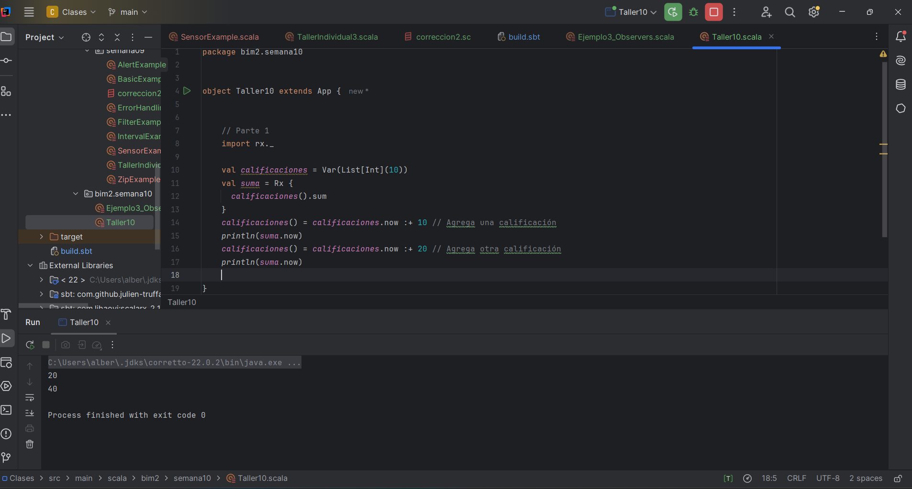
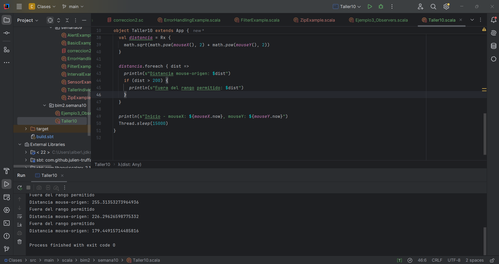

# Taller Individual  2
## Programación funcional reactiva

**Semana**: 10

**Objetivos**:

- Aplicar los conocimientos sobre programación funcional reactiva.

### Descripción:

Resuelva los siguientes problemas.

### Problema 1: Promedio de números

Crear un programa usando Rx que trabaje con una lista de números enteros (calificaciones) que cuando se actualiza se calcula automáticamente la suma de sus elementos y se almacena en la variable suma.

**Entrada esperada**
```yaml
calificaciones() = calificaciones.now :+ 10 // Agrega una calificación
calificaciones() = calificaciones.now :+ 20 // Agrega otra calificación
```

**Salida esperada**
```yaml
Suma actual = 20
Suma actual = 40
```

```scala
  import rx._

  val calificaciones = Var(List[Int](10))
  val suma = Rx {
    calificaciones().sum
  }
  calificaciones() = calificaciones.now :+ 10 // Agrega una calificación
  println(suma.now)
  calificaciones() = calificaciones.now :+ 20 // Agrega otra calificación
  println(suma.now)
```
> Adjuntar capturas de ejecución


### Problema 2: Seguimiento de coordenadas del mouse
Crea un programa que permita rastrear la posición del mouse en tiempo real y realice las siguientes acciones:

- Utiliza dos variables reactivas (Var), mouseX y mouseY, para almacenar las coordenadas X e Y actuales del mouse.
- Cada vez que cambie la posición del mouse:
  - Calcula automáticamente la distancia del cursor al origen (0, 0) usando la fórmula de distancia euclidiana. Almacena este cálculo en una variable reactiva (definición reactiva) llamada distancia.
  - Si la distancia al origen supera un umbral dado (por ejemplo, 200 unidades), imprime un mensaje indicando que el mouse está "Fuera del rango permitido".

```scala
  val mouseX = Var(0)
  val mouseY = Var(0)


Observable.interval(3.second).foreach { _ =>
val deltaX = Random.between(-100, 101)
val deltaY = Random.between(-100, 101)

    mouseX() = mouseX.now + deltaX
    mouseY() = mouseY.now + deltaY
}

val distancia = Rx {
math.sqrt(math.pow(mouseX(), 2) + math.pow(mouseY(), 2))
}

distancia.foreach { dist =>
println(s"Distancia mouse-origen: $dist")
if (dist > 200) {
println("Fuera del rango permitido")
}
}

println(s"Inicio - mouseX: ${mouseX.now}, mouseY: ${mouseY.now}")
Thread.sleep(15000)
```
> Adjuntar capturas de ejecución

### Calificación:

Una vez que termine debe presentar su trabajo a su docente.

- 10 puntos si presenta en el horario de prácticas y experimentación.
- 7 puntos presenta en el horario de tutoría
 
La hora máxima de presentación será las 8h30
