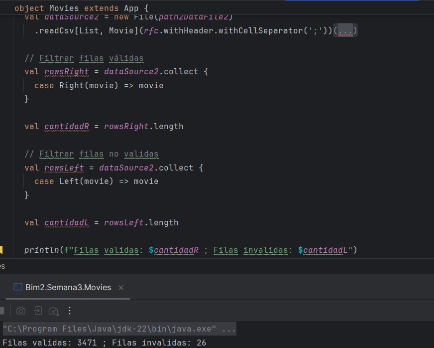
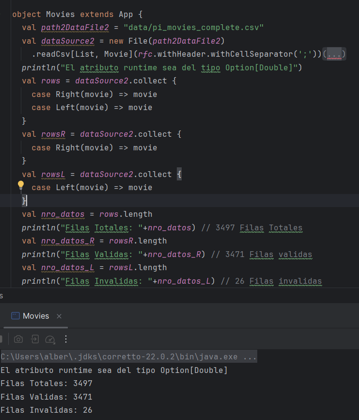
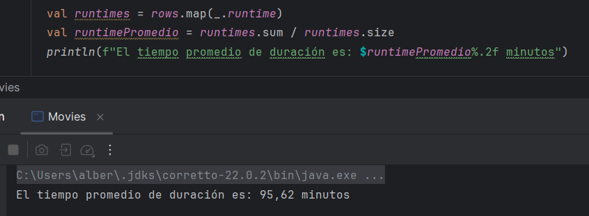
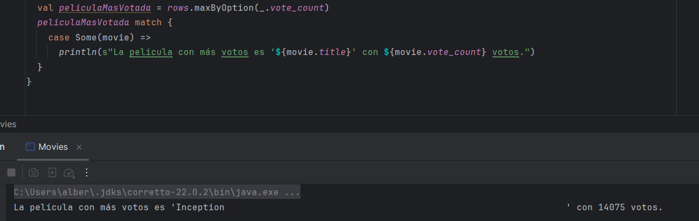
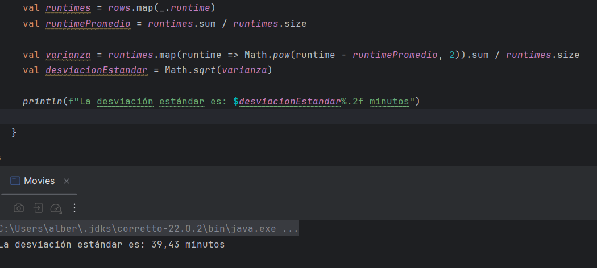

# Taller Grupal  1
## Programación funcional reactiva

**Semana**: 11

**Objetivos**:

- Crear un case class en Scala para modelar datos de un archivo CSV (data set de proyecto integrador).
- Manipular datos como una lista de objetos y realizar operaciones estadísticas.
- Comprender la relación entre datos y aplicar fórmulas estadísticas a análisis exploratorios.

> [!IMPORTANT]
> Resolver el siguiente problema en grupos según proyecto integrador (**solo estudiantes presentes en el aula**)

***


### Parte 1: Definición de case class y lectura de archivo

- Utilizando la case clase que construyó, como tarea, lea los datos del dataset de movies y trate de responder a las siguientes preguntas:

  Asegúrese que los atributos `popularity`, `runtime`, `vote_average` son de tipo real.

  - ¿Cuántas filas pudo leer?
  - ¿Cuántos filas son `Right`?
  - ¿Cuántos filas son `Left`?
#### Aplicacion del Codigo en Scala
```scala
import kantan.csv._
import kantan.csv.ops._
import kantan.csv.generic._
import java.io.File

case class Movie(
adult: Boolean,
belongs_to_collection: String,
budget: Int,
genres: String,
homepage: String,
id: Int,
imdb_id: String,
original_language: String,
original_title: String,
overview: String,
popularity: Double,
poster_path: String,
production_companies: String,
production_countries: String,
release_date: String,
revenue: Double,
runtime: Double,
spoken_languages: String,
status: String,
tagline: String,
title: String,
video: Boolean,
vote_average: Double,
vote_count: Int,
keywords: String,
cast: String,
crew: String,
ratings: String
)

object Movies extends App {
val path2DataFile2 = "C:\\Users\\bvalv\\OneDrive\\Escritorio\\pi_movies_complete.csv"

// Configurar lectura del CSV con delimitador ';'
val dataSource2 = new File(path2DataFile2)
.readCsv[List, Movie](rfc.withHeader.withCellSeparator(';'))

// Filtrar filas válidas
val rowsRight = dataSource2.collect {
case Right(movie) => movie
}

val cantidadR = rowsRight.length // Registrar la longitud de la lista con las filas validas

// Filtrar filas no validas
val rowsLeft = dataSource2.collect {
case Left(movie) => movie
}

val cantidadL = rowsLeft.length // Registrar la longitud de la lista con las filas invalidas

println(f"Filas validas: $cantidadR ; Filas invalidas: $cantidadL")
```

#### Captura de Pantalla de Ejecución
  
- Ahora modifique el case class para que el atributo runtime sea del tipo
`Option[Double]` y vuelva a responder las preguntas anteriores.

```scala
println("El atributo runtime sea del tipo Option[Double]")
  val rows = dataSource2.collect {
    case Right(movie) => movie
    case Left(movie) => movie
  }
  val rowsR = dataSource2.collect {
    case Right(movie) => movie
  }
  val rowsL = dataSource2.collect {
    case Left(movie) => movie
  }
  val nro_datos = rows.length
  println("Filas Totales: "+nro_datos) // 3497 Filas Totales
  val nro_datos_R = rowsR.length
  println("Filas Validas: "+nro_datos_R) // 3471 Filas validas
  val nro_datos_L = rowsL.length
  println("Filas Invalidas: "+nro_datos_L) // 26 Filas invalidas
```
#### Captura de Pantalla de Ejecución


### Parte 2: Análisis de datos

- ¿Cuál es el tiempo promedio que duran las películas dentro del dataset? (use la propiedad `runtime`)
- Encuentra el objeto `Movie` con el mayor número de votos (`vote_count`)
- Calcula la desviación estándar del tiempo de ejecución (`runtime`) usando la fórmula:

  $$
  \sigma = \sqrt{\frac{\sum_{i=1}^{n} (x_i - \overline{x})^2}{n}}
  $$

  Donde $x_i$ es la calificación de cada película, $\overline{x}$ es el promedio de las calificaciones y $n$ es el número total de películas.

> Adjuntar los bloques de código y capturas de ejecución
```scala
  val runtimes = rows.map(_.runtime)
  val runtimePromedio = runtimes.sum / runtimes.size
  println(f"El tiempo promedio de duración es: $runtimePromedio%.2f minutos")
```
#### Captura de Pantalla de Ejecución

```scala
  val peliculaMasVotada = rows.maxByOption(_.vote_count)
peliculaMasVotada match {
  case Some(movie) =>
    println(s"La película con más votos es '${movie.title}' con ${movie.vote_count} votos.")
}
```
#### Captura de Pantalla de Ejecución

```scala
val runtimes = rows.map(_.runtime)
val runtimePromedio = runtimes.sum / runtimes.size

val varianza = runtimes.map(runtime => Math.pow(runtime - runtimePromedio, 2)).sum / runtimes.size
val desviacionEstandar = Math.sqrt(varianza)

println(f"La desviación estándar es: $desviacionEstandar%.2f minutos")
```
#### Captura de Pantalla de Ejecución

### Calificación:

Una vez que termine debe presentar su trabajo a su docente.

- 10 puntos si presenta en el horario de prácticas y experimentación.
- 7 puntos si presenta en el horario de tutoría

La hora máxima de presentación será las 08h30
