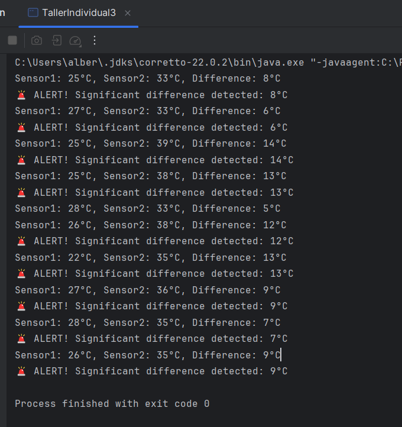

# Taller Individual  3
## Reactive Stream

**Semana**: 9

**Objetivos**:

- Aplicar los conocimientos sobre Reactive Stream.
- Generar y procesar flujos de datos reactivos.

### Descripción:

Resuelva los siguientes problemas.

### Problema 1
**Sincronización de Sensores**

Descripción: Simula dos sensores que emiten valores periódicos:

- Sensor1: Rango [20°C, 30°C], cada 1 segundo.
- Sensor2: Rango [30°C, 40°C], cada 1.5 segundos.
- Usa zip para combinar los valores de ambos sensores en un solo flujo.
- Detén el flujo después de 10 pares de valores.
- Genera una alerta si la diferencia absoluta entre las lecturas de Sensor1 y Sensor2 es mayor a 5°C.

```scala
package bim1.semana09

import rx.lang.scala.Observable
import scala.util.Random
import scala.concurrent.duration._

object TallerIndividual3 extends App {
// Crear flujos de dos sensores
val sensor1 = Observable.interval(1.second).map(_ => Random.between(20, 30)).take(10)
val sensor2 = Observable.interval(1.5.second).map(_ => Random.between(30, 40)).take(10)

// Combinar los flujos con zip
sensor1.zipWith(sensor2) { (temp1, temp2) =>
val diff = Math.abs(temp1-temp2)
println(s"Sensor1: $temp1°C, Sensor2: $temp2°C, Difference: $diff°C")
if (diff > 5) println(f"🚨 ALERT! Significant difference detected: $diff°C")
}.take(10).subscribe()

// Mantener la aplicación corriendo
Thread.sleep(15000)
}
```
```mathematica
Sensor1: 22°C, Sensor2: 27°C, Difference: 5°C
Sensor1: 24°C, Sensor2: 34°C, Difference: 10°C
🚨 ALERT! Significant difference detected: 10°C
```


### Problema 2
**Sistema de Alerta Complejo**

Descripción: Simula tres sensores que emiten datos periódicos:

- Sensor1: Temperatura (20°C a 30°C).
- Sensor2: Humedad (40% a 60%).
- Sensor3: Presión (950 hPa a 1050 hPa).
- Combina los datos de los tres sensores y detecta si alguna de las métricas está fuera de rango.
- Detén el flujo después de 20 combinaciones.

```yaml
Temperature: 22°C, Humidity: 50%, Pressure: 970 hPa
Temperature: 25°C, Humidity: 42%, Pressure: 1055 hPa
🚨 ALERT! Pressure out of range: 1055 hPa
...
```

### Calificación:

Una vez que termine la primera parte (a lápiz y papel), debe presentar su trabajo a su docente para poder continuar con la segunda parte (última pregunta)

- 10 puntos si presenta en el horario de prácticas y experimentación.
- 7 puntos presenta en el horario de tutoría

La hora máxima de presentación será las 08h30
